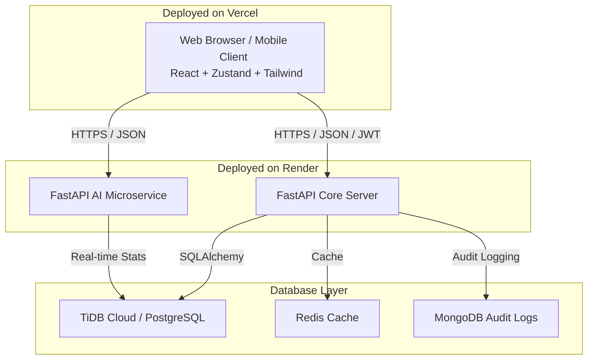

# Clarix ERP — Enterprise Resource Planning
## System Architecture & Technical Presentation Report

---

## 1. Executive Summary

**Clarix ERP** is a state-of-the-art, modular Enterprise Resource Planning (ERP) platform designed for modern enterprises. It integrates key business modules — ranging from Finance and Human Resources to Manufacturing, Supply Chain, Healthcare, and Sustainability — into a single, cohesive, secure, and resilient system. 

By leveraging **FastAPI (Python)**, **React (Vite)**, and **Cloud Databases (TiDB Cloud / PostgreSQL)**, Clarix ERP achieves enterprise-grade scalability, rapid response times, and bulletproof offline-first fallbacks.

---

## 2. System Architecture

Clarix ERP is built on a modern **three-tier architecture** optimized for high availability, security, and low latency:



*   **Frontend (Vercel)**: A premium, dark-themed Single Page Application (SPA) built using React, Vite, Framer Motion, Recharts, and Tailwind CSS. State is managed via a centralized Zustand store.
*   **Core Backend (Render)**: A FastAPI ASGI server handling unified JWT authentication, relational model storage (via SQLAlchemy ORM), transaction logic, and route guarding.
*   **AI Microservice (Render)**: A dedicated FastAPI instance managing machine learning forecasting, optical character recognition (OCR) for invoices, Natural Language Query (NLQ) intent classification, and Twilio WhatsApp webhook handlers.
*   **Database Tier (TiDB Cloud / PostgreSQL)**: An enterprise-grade transactional database with automatic SSL, backed by Redis for caching sessions and MongoDB for compliance audits.

---

## 3. Technology Stack

### Frontend (Client Tier)
*   **Framework**: React 18 & Vite (fast HMR, optimized assets)
*   **State Management**: Zustand (lightweight, decoupled global state)
*   **Styling & Design**: Tailwind CSS (sleek dark mode, Outfit font, custom glassmorphism components)
*   **Animations**: Framer Motion (premium micro-interactions, smooth hover-states)
*   **Charts & Visualization**: Recharts (fully responsive SVG analytics rendering)
*   **Routing**: React Router DOM (protected routes, role-based guard rails)

### Core Backend (Application Tier)
*   **Framework**: FastAPI (high-performance ASGI framework)
*   **ORM**: SQLAlchemy 2.0 (robust relation management, connection pooling)
*   **Authentication**: JWT (JSON Web Tokens via `python-jose`) & `passlib` with `bcrypt` encryption
*   **Caching**: Redis (in-memory caching for query results)
*   **Document/NoSQL**: Motor + AsyncIOMotorClient (non-blocking MongoDB access)

### Database & Infrastructure
*   **Relational Database**: TiDB Cloud (MySQL-compatible Serverless HTAP database) or PostgreSQL
*   **Hosting**: 
    *   **Frontend**: Vercel (Global Edge CDN, automatic TLS)
    *   **Backend & AI**: Render (Managed containers, auto-scaling)

---

## 4. Feature & Module Directory
Clarix ERP consists of **21 functional modules** mapped directly to specific operational roles:

| Module Name | Core Capabilities | Target Users |
| :--- | :--- | :--- |
| **Dashboard** | Unified KPI view, system status indicators, recent audits. | All Users |
| **Finance** | Chart of accounts, double-entry journal logs, GST/VAT compliance, budgeting. | Finance Staff |
| **HR** | Employee profiles, leave requests, daily attendance logs, payroll calculations. | HR Staff |
| **Inventory** | SKU tracking, warehouse movements, FIFO/LIFO valuations, reorder alerts. | Operations Staff |
| **Manufacturing** | Work orders, Bill of Materials (BOM) management, OEE calculations, QA logs. | Operations Staff |
| **Procurement** | RFQ management, purchase orders, supplier evaluation matrix, contracts. | Operations Staff |
| **Assets** | Fixed assets register, straight-line depreciation calculation, maintenance schedules. | Operations Staff |
| **Projects** | Project timelines, task assignments, milestones, resource allocation. | Operations Staff |
| **Supply Chain** | Carrier ratings, shipments tracking, logistics routing. | Operations Staff |
| **CRM** | Sales lead pipeline, customer accounts, opportunity probability, activity log. | Sales Staff |
| **E-Commerce** | Product listings, digital order management, payments integration. | Sales Staff |
| **Marketing** | Campaign budget logs, channel tracking, conversion rates analysis. | Sales Staff |
| **Analytics Hub** | Power BI-style MIS summaries, interactive Recharts widgets, KPI tracking. | All Users |
| **Banking** | Bank statement entries, Timing difference reconcile, loans amortization. | Finance Staff |
| **Healthcare** | Patient admission records, physician assignments, vital signs tracking. | HR / Medical Staff |
| **Education** | Student grades trackers, GPAs, fee status, attendance logs. | HR / Academic Staff |
| **Sustainability** | Carbon footprint calculator, renewable offsets logs, waste recycle KPIs. | Sustainability Staff |
| **Security** | Audits list, brute-force & SQL-injection threat alerts, IP track. | IT Staff |
| **RPA Automation** | Cron-jobs, document automation, queue triggers, webhook dispatchers. | IT Staff |
| **Migration Hub** | Database schema syncing, data validations, backup creation. | IT Staff |
| **Admin Panel** | User management, password resets, role permission matrix. | CEO Only |

---

## 5. Advanced AI Capabilities

The Clarix ERP system contains several modern, intelligent AI services integrated directly into the core workflow:

### A. Natural Language Query (NLQ)
*   **How it works**: Uses a FastAPI-powered natural language processor to detect user query intent (e.g., *"Show me our revenue this month"* or *"What's our inventory status?"*).
*   **Outcome**: Parses the query and dynamically replies with real-time statistics pulled from the database, combined with smart action suggestions.

### B. Machine Learning Forecasting
*   **Model**: Ordinary Least Squares (OLS) Linear Regression with random variance adjustments.
*   **Outcome**: Generates 6-month projections for metrics like revenue, inventory levels, and employee headcount, outputting lower/upper confidence bounds.

### C. Optical Character Recognition (OCR) Document Parser
*   **How it works**: Simulates an intelligent OCR scanner for uploaded PDFs/images.
*   **Outcome**: Extracts vendor name, invoice numbers, tax fields, and line items, preparing them for one-click ERP ingestion.

### E. Twilio WhatsApp Webhook Integrator
*   **How it works**: Translates incoming WhatsApp messages from stakeholders into backend NLP commands.
*   **Outcome**: Responds to users directly on WhatsApp with formatted reports (reconciled bank balances, active headcounts, low-stock warnings).

---

## 6. Security, RBAC, and Administration

Clarix ERP secures all data through strict **Role-Based Access Control (RBAC)**:

```
[User Login] ➔ [JWT Token Issued] ➔ [Allowed Modules Extracted] ➔ [Route Guards Enforced]
```

### Role-Permission Matrix Examples:
*   **Superadmin (CEO)**: Possesses absolute administrative privileges over all 21 modules, including the CEO-restricted Admin Panel, and can reset employee credentials.
*   **Finance Staff**: Allowed access only to `dashboard`, `finance`, `banking`, and `analytics_hub`.
*   **IT Staff**: Access to `dashboard`, `security`, `migration_hub`, `rpa_automation`, and `analytics_hub`.
*   **Route Guards**: The frontend enforces strict route guarding via the `hasModuleAccess()` function in `App.jsx`, checking permissions client-side. The backend replicates these checks via dependency injection (`require_module_access` and `require_ceo`) in `rbac_auth.py`.

---

## 7. High Availability & Offline Resiliency

To prevent corporate downtime, Clarix ERP implements two defensive failover layers:

### A. Frontend Offline-First Fallback
If the React application detects that the Render backend is unreachable (network timeout or server cold-start delay):
1.  **Zustand store** activates `demoMode = true`.
2.  The UI seamlessly shifts from API endpoints to **pre-seeded local mock data** (`seedData.js`).
3.  A dismissible **Amber Alert Banner** is shown:
    `⚠ Offline Demo Mode — Backend unreachable. Showing local demo data only.`
4.  Once the backend recovers, network success changes state to `dbLive = true` and turns off demo mode.

### B. Backend SQLite Fallback
If the FastAPI backend fails to connect to the cloud database (e.g., due to IP Whitelist blockers or service provider outages), the ORM catches the error in `db.py`:
1.  Logs: `Failed to connect to DATABASE_URL. Falling back to SQLite.`
2.  Constructs a local database: `sqlite:///./erp.db`.
3.  Ensures basic database operations remain functional until the cloud database is restored.

---

## 8. Deployment Strategy

### 1. Frontend (Vercel)
*   Build Script: `cd frontend && npm run build`
*   Output Directory: `frontend/dist`
*   Routing Rule: SPA rewrite configuration in `vercel.json` to route all page requests to `index.html`.

### 2. Backend & AI Microservices (Render)
*   Build Script: `pip install -r requirements.txt`
*   Startup Command: `python seed_rbac_complete.py && uvicorn app.main:app --host 0.0.0.0 --port $PORT`
*   *Note: Automatically seeds roles, departments, permissions, and the default CEO account (`ceo` / `admin123`) on startup.*
